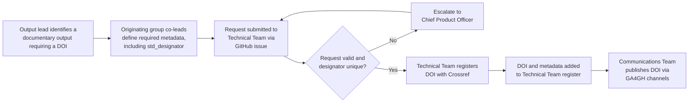

# Citing GA4GH Documentation

**Source**: TASC  
**Recommendation**: GA4GH-REC-05  
**Title**: Citing GA4GH documentation: A mechanism for creating digital object identifiers in support of GA4GH products  
**Related GitHub issues**: [#39](https://github.com/ga4gh/TASC/issues/39), [#179](https://github.com/samtools/hts-specs/issues/179)  
**Raised by**: Susan Fairley (Chief Standards Officer - GA4GH)  
**Authors**: Chen Chen, James Eddy, Ian Fore, Francesca Frexia, Jimmy Payyappilly, Angela Page, Alex Wagner, Andy Yates, Michael Baudis, Sasha Siegel  
**Date:** 2026-07-07  
**Status:** Draft  
**Keywords**: doi, citation  
**Work Streams Impacted**: All workstreams  
**Products Affected**: None directly  

## Abstract

This recommendation provides a uniform and consistent way for citing GA4GH products and documentary outputs by generation of a digital object identifier (DOI) where the GA4GH DOI prefix is `10.59756`. This guide is written from the understanding that DOIs will be minted via the Crossref service. We follow recommendations from Crossref \[CROSSREF\] to create DOIs with opaque suffixes that encode no fragile metadata, along with guidance on the required metadata to provide. The recommendation applies to GA4GH documentary outputs, including products, standards, protocols, technical specifications, white papers, and selected blog posts. It does not apply to datasets, tools, or other research resources.

## Table of contents

- [Recommendation](#recommendation)
- [Background](#background)
- [Detailed Guidance](#detailed-guidance)
- [Use Cases](#use-cases)
- [Considerations](#considerations)
- [References](#references)
- [Contributors](#contributors)
- [Notes](#notes)

## Recommendation

For significant GA4GH documentary outputs (e.g. products, standards, protocols, technical specifications, white papers, and selected blog posts) requiring a persistent identifier, Digital object identifiers (DOI) MUST use the GA4GH prefix `10.59756` resulting in DOIs with the following format `https://doi.org/10.59756/SUFFIX`. DOIs MUST be registered using the GA4GH approved Registration Agency, currently Crossref. DOI suffixes MUST be an opaque random string with no semantic meaning and encoding no fragile metadata. The *Detailed Guidance* lists the minimal metadata that MUST be provided, which include the `<std_designator>` metadata field, pointing to the originating group.

Registration requests MUST be submitted by raising a GitHub issue in the TASC repository, addressed to the originating group's co-leads (e.g. Work Stream, NIF, GIF, TASC) and then to the Technical Team, unless another automated minting method has been created. See *DOI Request Process* for the complete workflow.

The `<std_designator>` metadata field SHOULD follow the format `<ORIGINATING_GROUP_ACRONYM>_<DOCUMENT_NAME>`.

The Technical Team maintains a register of assigned suffixes, together with their associated `<ORIGINATING_GROUP_ACRONYM>` and `<DOCUMENT_NAME>` values, to avoid clashing DOIs, prevent duplicate or inconsistent designators, and enable reverse lookup. The list of authoritative `<ORIGINATING_GROUP_ACRONYM>` values is maintained in [originating-group-acronyms.yaml](./originating-group-acronyms.yaml); requesters MUST use an acronym from this list or request that a new one be added. DOIs MAY be created for any GA4GH digital output and for any version of a digital output. Newly approved products SHOULD request and assign a DOI to selected digital materials, including any specific versions. DOIs MUST NOT be minted for transitional or ephemeral materials e.g. a draft specification.

GA4GH DOIs work alongside those created by other authorities and organisations (e.g. publishers, open repositories) and do not replace or supplant them. GA4GH DOIs MUST NOT redirect to another DOI URI. This recommendation MUST apply to GA4GH documentary outputs and MUST NOT apply to datasets, tools or other research resources.

## Background

A way to cite GA4GH digital outputs such as specifications was originally discussed in 2016 in the hts-specs repository and later picked up on in 2022. The need was to create a way to cite a version of a GA4GH product without resorting to publications (the previous way this was achieved). Being able to generate DOIs would be one way of accomplishing this. Zenodo was cited as a possible solution but that results in a disconnect between the digital object a DOI points to and where said item is really maintained. Further discussion on Slack resulted in the conclusion that GA4GH should begin to mint DOIs itself and would do so through the Crossref platform as this would support "Standards" record types \[CROSSREF_RECORDS\].

## Detailed Guidance

GA4GH documentary outputs that represent approved standards, technical specifications, protocols, products, white papers, and other significant publications MUST be assigned a Digital Object Identifier (DOI) to provide a persistent, globally unique, and citable reference. The DOI MUST serve as the canonical identifier for the document and MUST remain stable regardless of future changes to document location or hosting infrastructure.

DOIs MUST use GA4GH's registered Crossref DOI prefix (`10.59756`) when minting DOIs for GA4GH documentary outputs. Associated metadata MUST be deposited with Crossref and MUST include all information required to support identification and discovery of the referenced document, including title, authors, publication date, location, and the designated `<std_designator>` value. The required metadata are listed under *Metadata Management*.

DOI suffixes MUST be generated as opaque identifiers and MUST NOT encode semantic or document-specific meaning. Human-readable information SHOULD be represented through deposited metadata rather than through the DOI structure itself.

### Standard Designator Assignment

Each DOI registration MUST include a `<std_designator>` metadata field identifying the originating group and document context. The `<std_designator>` value MUST follow the format:


```text
<ORIGINATING_GROUP_ACRONYM>_<DOCUMENT_NAME>
```

Examples include:

```text
FEDANALYSIS_WES
CLINPHENO_PHEN
DISCOVERY_BEACONV2
DURI_AAI
TASC_TS
```

Note that over time, originating groups can change names (e.g. Work Streams are sometimes renamed). Use the name of the originating group at the time of minting. Originating groups SHOULD use concise and stable designator values to promote consistency across DOI registrations. The `<std_designator>` value MUST uniquely identify the document category within the context of the originating group. The Technical Team's register of assigned designators (see *Recommendation*) MUST be checked prior to registration to avoid clashing or inconsistent values.


### DOI Request Process

Individuals responsible for a documentary output requiring a DOI (output leads) MUST submit a DOI request through their originating group co-leads (e.g. Work Stream, NIF, GIF, or TASC leads). These co-leads MUST define the metadata associated with the DOI request, including the `<std_designator>`, in collaboration with the output leads. The completed request MUST be submitted to the GA4GH Technical Team, by raising a GitHub issue in the TASC repository, together with all required metadata (see *Metadata Management* for the complete list). The Technical Team MUST verify that the request is legitimate and appropriate, and that the proposed `<std_designator>` does not clash with an existing entry in the register, prior to DOI creation. Where uncertainty exists regarding eligibility or governance, the Technical Team MAY escalate the request to the Chief Product Officer. Following DOI registration, the Technical Team MUST provide the DOI to the GA4GH Communications Team for publication through appropriate GA4GH channels. Automated versions of this process are permitted so long as the ethos of this flow is retained.



### Metadata Management

Metadata associated with a DOI MUST accurately describe the referenced document at the time of registration. Metadata SHOULD be updated when document locations or other deposited metadata elements change. Where a document is relocated, the DOI MUST continue to resolve to the authoritative version of the document. Changes in document location MUST NOT require minting a new DOI unless a new citable object is being created.

The complete list of required metadata follows. Fields marked *"to be specified"* MUST be supplied by the requester:

- Contributor → Organization: to be specified — the name of the originating group (e.g. "GA4GH Federated Analysis Work Stream"), per Crossref's definition of this field as the body contributing the standard
- Title: to be specified
- Approval Date (month, day, year): to be specified — the date the document itself was approved by its originating group, not the date the DOI was submitted to Crossref
- Publisher Name: Global Alliance for Genomics and Health
- Publisher Place: Toronto, ON, CA
- Standards Body Name: Global Alliance for Genomics and Health
- Standards Body Acronym: GA4GH
- Resource (URL): to be specified
- Depositor Name (submitter): Global Alliance for Genomics and Health
- Registrant: Global Alliance for Genomics and Health
- Submitter email address: ga4gh-tech-team@ga4gh.org

For example, a request for the WES specification from the Federated Analysis Work Stream might supply:

| Field | Value |
|-------|-------|
| Contributor → Organization | GA4GH Federated Analysis Work Stream |
| Title | Workflow Execution Service (WES) API |
| Approval Date | 2026-03-15 |
| Publisher Name | Global Alliance for Genomics and Health |
| Publisher Place | Toronto, ON, CA |
| Standards Body Name | Global Alliance for Genomics and Health |
| Standards Body Acronym | GA4GH |
| Resource (URL) | `https://github.com/ga4gh/workflow-execution-service-schemas` |
| Depositor Name (submitter) | Global Alliance for Genomics and Health |
| Registrant | Global Alliance for Genomics and Health |
| Submitter email address | ga4gh-tech-team@ga4gh.org |
| `<std_designator>` | `FEDANALYSIS_WES` |

## Use Cases

### Use case - Approved GA4GH Products

When a product is approved through the GA4GH Product Development and Approval Process, DOIs MUST be assigned to support persistent and version-specific citation. Following discussion at a TASC workshop, DOI registration MUST, at a minimum, be considered for:

- The latest version of the product specification
- The product's landing page on the GA4GH website
- The product's documentation (e.g. GitHub Pages, ReadTheDocs, or similar)

Work Streams MAY additionally register a DOI for a specific approved version of the product specification where version-level citation is required, independent of the DOI assigned to the latest version.

For example, a hypothetical GKS product named *Quatsch* could use the designator `GKS_QUATSCH` to associate DOI registrations with the product and related documentation.

### Use case - White Papers and Position Pieces

GA4GH white papers, briefing documents, and position statements SHOULD be assigned a DOI that resolves to the authoritative GA4GH-controlled version of the document. External publication through repositories such as Zenodo or bioRxiv MUST NOT prevent the creation of a GA4GH-managed DOI. For example, a Regulatory and Ethics Work Stream position paper may use a designator such as `REWS_POSITIONPIECE` to identify the publication type within DOI metadata.

### Use case - Blog Posts and Web Publications

Blog posts, announcements, and news articles that require persistent citation MAY be assigned a DOI. In these cases, the DOI SHOULD be registered using a designator associated with GA4GH web content such as `GA4GHWEB_POST`. This enables long-term citation of significant web-based publications while maintaining consistency with other GA4GH documentary outputs.

### Use case - How to cite a GA4GH Product

Once a DOI has been assigned, authors citing the product SHOULD reference the DOI URL directly, following standard citation practice for the target publication venue. For example:

```text
Global Alliance for Genomics and Health. GA4GH Workflow Execution Service (WES) API Specification v1.1.0. https://doi.org/10.59756/SUFFIX
```

Work Streams SHOULD additionally consider providing a [Citation File Format (CFF)](https://citation-file-format.github.io/) file (`CITATION.cff`) in the product's repository, pre-populated with the registered DOI, to give downstream users a machine-readable, authoritative citation string and reduce reliance on citing incidental publications.

## Considerations

- This recommendation applies to citation of GA4GH documentary outputs and MUST NOT be interpreted as a general-purpose identifier framework for datasets, software implementations, APIs, schemas, or data exchanged between systems.
- Citation and machine-readable identification are distinct requirements. While a DOI provides a stable citation mechanism for publications and documentation, additional identifier mechanisms MAY be required where standards need to be referenced within APIs, service registries, metadata models, or software implementations.
- DOI assignment SHOULD be considered independently from publication venue. A document MAY be published through multiple channels while retaining a single authoritative GA4GH-managed DOI.
- Originating groups SHOULD establish clear guidance regarding the versioning strategy for documentary outputs. Readers and implementers MUST be able to determine which version of a specification is being referenced by a citation.
- Multiple citation targets MAY exist for a single GA4GH product, including an approved specification, the latest specification, supporting documentation, and the product landing page. Originating groups SHOULD ensure that each DOI resolves to a clearly defined and distinguishable citable object.
- The creation of a DOI introduces a long-term maintenance obligation. GA4GH MUST ensure that associated metadata and resolution targets remain current throughout the lifetime of the identifier.
- Changes to document hosting platforms, repository structures, website implementations, or publication locations MUST NOT result in unnecessary DOI reassignment. Existing DOIs SHOULD continue to resolve to the authoritative version of the referenced document.
- Consistency across originating groups is a primary objective of this recommendation. Originating groups SHOULD follow a common DOI registration and metadata model to avoid the introduction of competing citation practices within GA4GH.
- DOI assignment improves citation stability but does not replace the need for product governance, version management, release processes, or publication review procedures.
- Originating groups SHOULD consider the granularity of DOI assignment carefully. Assigning too few identifiers may limit citation precision, while assigning too many may introduce unnecessary governance and maintenance overhead.
- Providing a `CITATION.cff` file in a product's repository, referencing its registered DOI, is a complementary way to guide external authors toward the authoritative citation and away from citing an unrelated or incidental publication.

## References

- \[CROSSREF\] \- [Crossref: a DOI issuer](https://www.crossref.org/)
- \[CROSSREF_RECORDS\] \- [Crossref Supported Record Types](https://www.crossref.org/documentation/schema-library/markup-guide-record-types/)
- \[TASC-ADR-001\] - [TASC-ADR-001: Use Crossref as the DOI Registration Authority for GA4GH](./TASC-ADR-001.md)
- \[TASC-ADR-002\] - [TASC-ADR-002: Separate Citation Identifiers from Machine-Readable Standard Identifiers](./TASC-ADR-002.md)
- \[TASC-ADR-003\] - [TASC-ADR-003: Use Opaque DOI Suffixes](./TASC-ADR-003.md)
- \[TASC-ADR-004\] - [TASC-ADR-004: Use Standard Designators for DOI Metadata Classification](./TASC-ADR-004.md)
- \[TASC-ADR-005\] - [TASC-ADR-005: Do Not Extend GA4GH DOIs to Other Research Resources](./TASC-ADR-005.md)

## Contributors

This section lists reviewers and discussion participants who contributed to the development of this recommendation, in addition to the authors listed above.

| Name | Organisation |
|------|-------------|
| Chen Chen | Ontario Institute for Cancer Research, GA4GH |
| James Eddy | Sage Bionetworks |
| Ian Fore | Independent |
| Francesca Frexia | Centre for Advanced Studies, Research and Development in Sardinia (CRS4) |
| Jimmy Payyappilly | EMBL-EBI, GA4GH |
| Angela Page | Broad Institute, GA4GH |
| Alex Wagner | Nationwide Children's Hospital |
| Mónica Muñoz Torres | University of Colorado Anschutz |
| Robert R. Freimuth | Mayo Clinic |
| Andy Yates | HDR UK |
| Michael Baudis | University of Zurich |
| Sasha Siegel | EMBL-EBI, GA4GH |

## Notes

OpenAI ChatGPT 5.5 (June 2026) was used to interpret and reformat original Google documents into this format. Claude Sonnet 5 (high effort - July 2026) was used to integrate follow-up changes. Claude Sonnet 5 (July 2026) was also used to review PR #86 on GitHub and integrate reviewer feedback (terminology consistency, metadata clarifications, a request-process diagram, a "How to Cite" use case, and cross-reference fixes) into this document and the accompanying ADRs. All content has been reviewed for accuracy.
